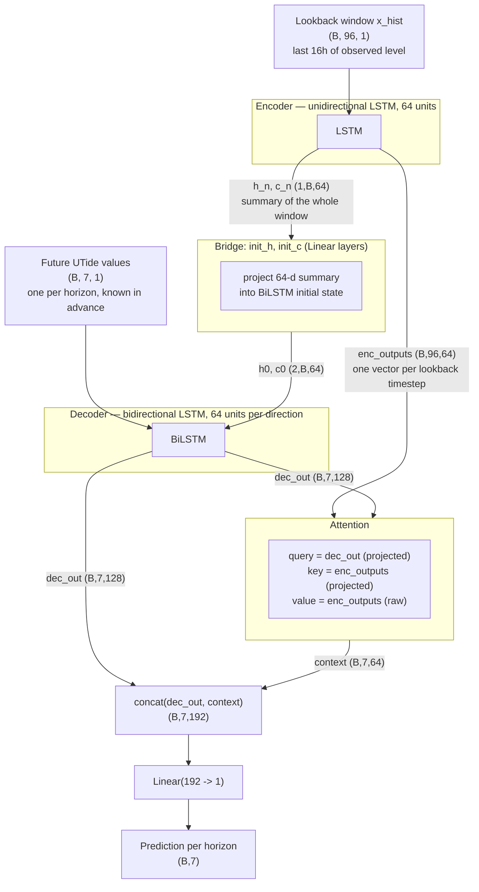

# Stage 2 Model Architecture — UTide-Informed Attention BiLSTM

**Model:** `TidalSeq2Seq` (encoder LSTM + attention + bidirectional LSTM decoder)
**Notebook:** [`stage2_utide_attention.ipynb`](stage2_utide_attention.ipynb), sections 8–9
**Task:** given the last 16h of observed Southend Pier water level, forecast the water level at seven horizons simultaneously (10min, 1h, 6h, 24h, 48h, 72h, 168h), using the UTide astronomical tide prediction as a known future input.

This note explains *how the model works*, not just what it's made of — the goal is to be able to reconstruct the architecture from memory, explain why each piece is there, and write about it without leaning on the code.

**Next stage:** [`stage3_architecture.md`](stage3_architecture.md) adds meteorological covariates (pressure, wind, rainfall, discharge) via three parallel per-resolution encoders, and redesigns the decoder in a way that both fixes a positional asymmetry in the BiLSTM below (§6) and extends the trained forecast horizon from 168h out to 30 days.

---

## 1. The one-paragraph version

The model is a standard **encoder–decoder with attention**, the same family as machine-translation seq2seq models, adapted for forecasting. An LSTM **encoder** reads the past 96 ten-minute readings (16 hours) and produces a summary. A bidirectional LSTM **decoder** then produces one prediction per forecast horizon — but instead of generating each step from its own previous guess (the usual autoregressive way), it's given the **UTide astronomical tide prediction at each horizon as input**, since that's known in advance regardless of when you're standing. At each horizon, an **attention mechanism** lets the decoder look back over all 96 encoder timesteps and pull in whichever parts of the recent past are most relevant to that particular horizon, rather than relying on a single fixed summary vector.

If you need to say it in one breath: *"an LSTM reads the recent tidal history, a bidirectional LSTM decoder reads the known future tide prediction, and attention connects the two so each forecast horizon can pull in the most relevant slice of recent history."*

---

## 2. Inputs and outputs

| | shape | meaning |
|---|---|---|
| `x_hist` (encoder input) | `(B, 96)` | last 96 × 10-min observed water levels (16h), scaled |
| `utide_future` (decoder input) | `(B, 7)` | UTide-reconstructed tide at each of the 7 target horizons, scaled |
| `preds` (model output) | `(B, 7)` | predicted water level at each of the 7 horizons, scaled |
| `attn_weights` (side output) | `(B, 7, 96)` | how much each horizon's prediction attended to each of the 96 lookback timesteps |

`B` is the batch size. The 7 horizons, in order, are `{10min, 1h, 6h, 24h, 48h, 72h, 168h}` — note they're in **increasing order**, which matters later for why a bidirectional decoder makes sense here.

Both `x_hist` and `utide_future` carry a single feature (observed level / predicted tide, respectively) — there's no meteorological data yet, that's the next stage.

### 2.1 The shape grammar — how to read `(B, 96, ...)` and friends

Every tensor shape in this document follows the same three-slot convention PyTorch uses for a recurrent layer built with `batch_first=True` (every LSTM here is):

$$(\underbrace{B}_{\text{batch}},\ \underbrace{T}_{\text{sequence / time}},\ \underbrace{F}_{\text{features}})$$

- **Slot 1 — `B`, batch.** How many independent examples are stacked together and pushed through the network in one go. This slot is inert: nothing in the model ever mixes information *across* batch items — every operation combines information across the other two slots, separately, for each batch item. `B` is fixed the moment a mini-batch is drawn and passes through the whole model unchanged; that's why every shape in section 9 starts with `B`.
- **Slot 2 — `T`, sequence/time.** How many distinct positions are being represented. This is genuinely different on the two sides of the model: `T = 96` for everything encoder-side (one position per 10-minute lookback step), `T = 7` for everything decoder-side (one position per forecast horizon). Attention briefly needs *both* `T`s at once — its raw scores are shaped `(B, 7, 96)`: "for each of the 7 decoder positions, one number per encoder position."
- **Slot 3 — `F`, features.** How many numbers describe *each* position. This is the slot that changes most as data moves through the network: it starts at `1` (a single scalar — a water level or a tide height), and grows every time an LSTM or linear layer touches it, because that growth *is* the point of those layers — turning a thin raw number into a richer, learned representation.

**What `B` actually *is* in this project.** It isn't 96 gauges or 96 variables — it's `B` different *sliding windows*, each anchored at a different point in calendar time. `build_windows_multi()` in the notebook slides a window across the cleaned Southend record: for a given anchor timestep, it grabs the 96 readings immediately before it (`X`, the encoder input) and pairs them with the UTide value and the true observed value at seven fixed offsets after the anchor — 10min, 1h, 6h, 24h, 48h, 72h, 168h later (`Ydec` and `Y` respectively). One row of `B` is one such anchor point. The training set has roughly one of these for every valid 10-minute timestamp in 2004–2017 (subsampled every 3rd step via `TRAIN_STRIDE`), and `BATCH_SIZE = 512` of them are grouped together and pushed through the model as one `(512, 96)` / `(512, 7)` pair per training step. So the honest translation of `(B, 96)` is: *"`B` different 16-hour windows of history, each one 96 numbers long"* — not 96 of anything else.

**A reading recipe.** For any shape tuple in this document, ask, in order: (1) how many examples am I looking at — usually `B`, or a batch slice of it; (2) how many positions in a sequence, and *which* sequence — the 96-step lookback, the 7-step horizon list, or (in attention) both at once; (3) how many numbers per position, and has that already been turned from the raw `1` feature into a `64`- or `128`-d learned representation by an LSTM.

**How the common operations move you between shapes:**

| operation | what it does to the shape |
|---|---|
| `.unsqueeze(-1)` | adds a trailing feature dim of size 1 — turns a bare `(B, T)` scalar sequence into `(B, T, 1)`, because `nn.LSTM` always wants an explicit feature dimension, even a size-1 one |
| `nn.LSTM(...)` | leaves `T` alone (one hidden vector *out* per input position *in*); turns slot 3 into `hidden_size`, or `2 × hidden_size` if `bidirectional=True`, since the forward- and backward-pass outputs are concatenated, not merged some other way |
| `nn.Linear(in, out)` | only touches slot 3; applied independently and identically at every position, so `T` (and `B`) pass through untouched |
| `torch.cat([...], dim=-1)` | adds slot-3 sizes together (e.g. `128 + 64 → 192`); `B` and `T` must already match and are left alone |
| `torch.bmm(A, B)` | batched matrix multiply — slot 1 (`B`) is preserved untouched; per batch item, it's ordinary 2D matrix multiplication on the remaining two dims, e.g. `(7,64) @ (64,96) → (7,96)` |
| `.softmax(dim=-1)` | doesn't change the shape at all — just rescales the values along the chosen axis so they sum to 1 |
| `.squeeze(-1)` | removes a trailing size-1 dim — the reverse of `unsqueeze` |

---

## 3. Overview diagram



---

## 4. The encoder — reading the past

**Code:** `Encoder` class, `models/stage2_utide_attention.ipynb` section 8a.

```python
self.lstm = nn.LSTM(input_size=1, hidden_size=64, num_layers=1, batch_first=True)
enc_outputs, (h_n, c_n) = self.lstm(x_hist.unsqueeze(-1))
```

### Intuition

The encoder reads the 96-step lookback window one 10-minute step at a time, left to right, updating an internal state as it goes — the same way you'd build up an understanding of a sentence word by word. By the end, that internal state is a compressed summary of "what the water level has been doing for the last 16 hours."

It's **unidirectional** (reads only forward in time) deliberately: at inference time you only ever have the past, never the future, of the input window — so there's nothing to gain from a backward pass here, and using one would be misleading about what information is actually causally available.

### The LSTM cell, formally

At each timestep $t$, given the current input $x_t$ (here, a single scalar — the water level 10 minutes further along) and the previous hidden/cell state $(h_{t-1}, c_{t-1})$:

$$
\begin{aligned}
i_t &= \sigma(W_{ii} x_t + b_{ii} + W_{hi} h_{t-1} + b_{hi}) &&\text{input gate} \\
f_t &= \sigma(W_{if} x_t + b_{if} + W_{hf} h_{t-1} + b_{hf}) &&\text{forget gate} \\
g_t &= \tanh(W_{ig} x_t + b_{ig} + W_{hg} h_{t-1} + b_{hg}) &&\text{candidate update} \\
o_t &= \sigma(W_{io} x_t + b_{io} + W_{ho} h_{t-1} + b_{ho}) &&\text{output gate} \\
c_t &= f_t \odot c_{t-1} + i_t \odot g_t &&\text{new cell state} \\
h_t &= o_t \odot \tanh(c_t) &&\text{new hidden state}
\end{aligned}
$$

$\sigma$ is the sigmoid function (squashes to (0,1), so the gates act like soft switches), $\odot$ is elementwise multiplication.

**Why this specific structure, in plain terms:** the *cell state* $c_t$ is a running memory that information can flow along mostly unchanged (it's just added to, not repeatedly multiplied through a nonlinearity) — that's what lets an LSTM remember something from 90 steps ago without it fading out, which a plain RNN struggles with. The three gates control that memory:
- the **forget gate** decides how much of the old memory to keep vs. discard,
- the **input gate** decides how much of the new candidate information to write in,
- the **output gate** decides how much of the memory to actually expose as the hidden state right now.

For a tidal signal, this maps onto something concrete: the cell state can carry "where we are in the tidal cycle" over many steps, while the gates let the network be more or less sensitive to the very latest reading depending on context (e.g. near a turning point vs. mid-cycle).

### What comes out

Two things are kept from the encoder, for two different purposes:

- **`enc_outputs`**, shape `(B, 96, 64)` — the hidden state $h_t$ at *every* one of the 96 timesteps, stacked. This is the encoder's full "memory trace," and it's what the attention mechanism will search over later.
- **`(h_n, c_n)`**, each shape `(1, B, 64)` — just the *final* hidden and cell state, i.e. $h_{96}$ and $c_{96}$. This is the single-vector summary of the whole window, used to initialise the decoder (next section).

### Why 96 steps (16 hours), specifically

Two numbers set the bounds on this choice, and both come from the physical tide rather than a hyperparameter sweep.

**Lower bound: it has to span more than one semi-diurnal cycle.** The M2 constituent (the dominant lunar tide) has a period of 12h 25.2min, which is `M2_STEPS = 74.5` ten-minute steps, defined explicitly as a constant in the notebook's setup cell (section 1). A lookback shorter than that risks catching only a fragment of one limb of the tide (only the rising half, say), which is ambiguous: the network can't distinguish "mid-flood, high amplitude" from "mid-ebb, low amplitude" from a partial curve alone. 96 steps is about 1.3 M2 cycles, comfortably more than one full oscillation, enough to see a complete high-low-high (or low-high-low) pattern and read off phase and amplitude unambiguously.

**Upper bound: going further doesn't buy much, for two separate reasons.** First, cost: this was already the binding constraint once attention and a second decoder were added (`BATCH_SIZE` was halved from stage 1's 1,024 to 512 specifically because of that added memory cost, section 1), and LSTMs don't reliably propagate a subtle signal across the thousands of steps a spring-neap cycle would require (roughly 14.77 days, over 2,000 ten-minute steps), even with gating. Second, and more fundamentally: there's nothing left for a longer lookback to usefully learn. The spring-neap modulation and the longer nodal cycle are already encoded deterministically in `utide_future`, the decoder's known-future input, so the encoder doesn't need to rediscover them from 2,000 raw steps of noisy correlation. What a longer lookback *would* still be trying to capture, the current surge/weather departure from the astronomical tide, decorrelates over hours to a day or two, well inside a 16-hour window. Extending the lookback to a week wouldn't give the encoder meaningfully more information about *that* signal, it would just make training harder for no return. Genuinely longer-memory information (multi-day weather patterns, antecedent river conditions) is handled properly in the next stage via explicit meteorological covariates, not by brute-forcing a longer raw lookback.

One-line version, if asked cold: *"96 steps is a little over one full M2 cycle: long enough to read the current tidal phase and amplitude unambiguously, short enough to stay inside the horizon where LSTMs actually train well and where the surge signal (the thing the tide can't already tell you) is still correlated. Anything the model would need beyond that is either already handed to it deterministically via UTide, or belongs to meteorological covariates instead."*

---

## 5. The bridge — handing off from encoder to decoder

**Code:** `init_h`, `init_c` in the `TidalDecoder` class, section 8c.

```python
self.init_h = nn.Linear(enc_hidden_size, num_layers * 2 * hidden_size)  # 64 -> 128
self.init_c = nn.Linear(enc_hidden_size, num_layers * 2 * hidden_size)
...
h0 = self.init_h(h_last).view(B, 2, 64).permute(1, 0, 2)  # -> (2, B, 64)
c0 = self.init_c(c_last).view(B, 2, 64).permute(1, 0, 2)
```

The encoder's summary, $h_{96}$, is a single 64-dimensional vector per batch item. The decoder, being **bidirectional**, needs *two* initial hidden states — one for the direction that reads horizons near-to-far, one for far-to-near. A `Linear(64, 128)` layer projects the one 64-d summary out to 128 dimensions, which is then split into two 64-d halves: one becomes the forward direction's starting state, the other the backward direction's. Both halves are *learned, different* projections of the same underlying encoder summary — the network decides during training what each direction should "start believing" given that summary. The identical construction is repeated for the cell state.

This is the one place where the encoder's understanding of the past actually reaches the decoder as a starting point — everything else the decoder learns about the past comes through attention (next-next section), not through this initial state.

---

## 6. The decoder — a non-autoregressive design

**Code:** `TidalDecoder` class, section 8c; `nn.LSTM(..., bidirectional=True)`.

```python
self.lstm = nn.LSTM(input_size=1, hidden_size=64, num_layers=1,
                     batch_first=True, bidirectional=True)
dec_out, _ = self.lstm(utide_future.unsqueeze(-1), (h0, c0))  # -> (B, 7, 128)
```

### Why this decoder doesn't work like a translation decoder

In a typical seq2seq decoder (e.g. machine translation), each output token is generated one at a time, and *fed back in* as the input for generating the next token — it has to be autoregressive, because the model doesn't know what word 5 is until it has already produced words 1–4. That approach has two problems for this task: errors compound as the horizon grows, and it's inherently sequential (slow, and can't look "ahead" while deciding on an early step).

This decoder sidesteps both problems, because there's a shortcut available: the input at every horizon is **already known in advance**, before the model produces anything — the UTide astronomical tide reconstruction can be computed for any timestamp, past or future, the moment the harmonic constituents are fit. So instead of generating step $j$ from a guess at step $j-1$, the decoder is simply *given* the UTide value at every horizon simultaneously, as an input sequence of length 7, exactly the way you'd feed a sentence to an encoder. This is the same trick used by models like DeepAR or the Temporal Fusion Transformer for calendar features: separate the inputs you'll only know once you get there from the inputs you already know now, and feed the "known now" ones directly rather than predicting them.

### 6.1 The evidence: what actually goes wrong with the alternatives

This isn't just a theoretical argument — this project independently measured both failure modes, on this exact dataset, before this decoder design was settled on. It's worth walking through both, since "better than autoregression" and "better than a regular LSTM" are actually two *different* problems with two different causes, and the fix for one doesn't automatically fix the other.

**Failure mode 1 — genuine autoregression (a standard seq2seq decoder).** `models/initial_modelling.ipynb` section 13 does exactly this: take a plain single-step LSTM/RNN/MLP (trained only to predict 10 minutes ahead), then generate a multi-step forecast by feeding each prediction back in as if it were a real observation, sliding the window forward, and repeating — 288 times to reach 48h. This is `recursive_rollout()` in that notebook, and it's a completely standard autoregressive rollout, the same pattern a translation decoder uses. Measured RMSE at 48h:

| model | mechanism | 48h RMSE (m) |
|---|---|---|
| Persistence (naive) | — | 1.32 |
| Recursive rollout — **LSTM** | autoregressive, own predictions fed back 288× | **1.01** |
| Recursive rollout — **RNN** | autoregressive, own predictions fed back 288× | **0.63** |
| Recursive rollout — **MLP** | autoregressive, own predictions fed back 288× | **0.39** |
| UTide standalone | pure astronomy, no learning at all | 0.24 |

The LSTM — architecturally the "smartest" of the three — comes out *worst*, barely beating naive persistence and losing badly to a plain harmonic tide table with zero learning in it. This is **exposure bias / error compounding**: the model was trained on real, clean 10-minute-ahead predictions, but at inference it's fed its *own* increasingly-wrong output as if it were ground truth, over and over. Two things make it worse for the recurrent models specifically: every recursive step, the small error at $t{+}1$ becomes part of the visible input window for predicting $t{+}2$, so the corruption keeps re-entering the model (this happens for the MLP too) — but the LSTM/RNN *also* carry a hidden state forward call-to-call implicitly through the corrupted window, so drift compounds through both the input sequence and the recurrence, which is consistent with it degrading faster than the memoryless MLP.

**Failure mode 2 — a "regular" LSTM without tidal information (no autoregression, but no known-future input either).** This is a different design: predict all 7 horizons directly, in one shot, from a fixed final hidden state — no recursion, no compounding. `stage2_utide_attention.ipynb` section 9a trains exactly this (`FlatMultiHorizonLSTM`), as a fair, non-autoregressive stage-1 baseline:

| model | mechanism | 48h RMSE (m) | 168h RMSE (m) |
|---|---|---|---|
| Direct multi-horizon flat LSTM (no tide) | one shot, no autoregression, **no tidal input** | 0.386 | 0.784 |
| Direct multi-horizon flat MLP (no tide) | one shot, no autoregression, **no tidal input** | 0.387 | 0.799 |
| UTide standalone | pure astronomy | 0.244 | 0.246 |
| **Stage-2: attention + known-future UTide covariate** | one shot, no autoregression, **tide input given** | **0.226** | **0.235** |

Removing autoregression already helps a lot on its own — the flat LSTM's 0.386m at 48h beats every recursive-rollout number above — but it still plateaus badly by 168h, ending up *worse than just using UTide alone*. That's not error compounding (there's none of that mechanism left); it's an **information ceiling**. A 16-hour lookback window simply doesn't contain the information needed to know where in a multi-day/multi-week tidal cycle you'll be a week from now — the model would have to have memorised the entire astronomical ephemeris purely from 14 years of correlational pattern-matching on 96-step windows, with no explicit period/phase signal to anchor it. It can't, so at long horizons it degrades toward guessing something close to the unconditional mean.

**Why Stage-2 avoids both.** It's non-autoregressive (every horizon comes directly from the true, correctly-known UTide value at that horizon — never from the model's own earlier guess), so failure mode 1 doesn't apply: there's no self-generated error to feed back in, ever. And it's *given* the tidal phase directly via the decoder input, rather than being asked to reconstruct it from a short lookback window, so failure mode 2 doesn't apply either: the network's actual learning problem is reduced to "predict the surge/weather residual on top of a tide value I already know is correct" — a bounded correction task, not open-ended extrapolation. That's also why Stage-2 tracks *just below* the UTide-standalone curve at every horizon (0.226m and 0.235m vs. UTide's 0.244m and 0.246m) instead of drifting away from it the way both failure modes above do: it isn't fighting the tide, it's correcting it.

*(Caveat for citing these together: the failure-mode-1 numbers come from a different notebook/test slice — the longest gap-free run in the test set, rolled out every 24h — rather than the full 2021–2024 test set used everywhere else in `stage2_utide_attention.ipynb`. The direction of the result is robust and the recursive-rollout code is right there to rerun on the same slice if you want a strictly matched number for a report.)*

### 6.2 The direct answer, if asked cold: why not standard autoregressive forecasting?

Two separable problems, only one of which is actually about autoregression itself.

**Problem 1: exposure bias / error compounding. This is the one that specifically comes from autoregression.** A standard autoregressive forecaster is trained on clean, real inputs (predict step $t{+}1$ from the true history up to $t$), but at inference, for a multi-step forecast, it has to feed its *own* prediction back in as if it were a real observation, then predict off that, then feed that back in, and so on. Training and inference therefore see different input distributions: training never shows the model a slightly-wrong input, inference is nothing but slightly-wrong, then more-wrong, then very-wrong inputs. The recursive-rollout evidence above is the direct measurement of this on this dataset: the LSTM, architecturally the "smartest" of the three rolled-out models, ends up *worst* at 48h (1.01m RMSE), barely ahead of naive persistence (1.32m) and well behind a zero-learning harmonic table (0.24m), because it's compounding its own errors 288 times over.

**Problem 2: no anchor to clock time. This is a separate issue that autoregression doesn't cause, and that removing autoregression alone doesn't fix.** Even the *non*-autoregressive flat baseline (`FlatMultiHorizonLSTM`, second table above), which predicts all 7 horizons directly from one hidden state with no recursion at all, still degrades to worse than UTide alone by 168h (0.784m vs. UTide's 0.246m). That's not compounding error (there's no recursion left to compound), it's an information ceiling: a 16-hour window of raw water level simply doesn't contain next week's tidal phase, and the network has no other way to know it.

**Why Stage-2's design (known-future covariate, non-autoregressive) fixes both at once.** It avoids problem 1 because nothing about it is autoregressive: every horizon is generated directly from the true, already-known UTide value at that horizon, never from the model's own earlier guess, so there's no self-generated error to feed back in, ever. It avoids problem 2 because the decoder is handed the tidal phase directly as an input, rather than being asked to infer it from a short lookback, so the network's actual job shrinks from "extrapolate the whole future tide from 16 hours of history" to "predict the surge/weather correction on top of a tide value I already know is right", a bounded correction task rather than open-ended extrapolation. That's the mechanism behind Stage-2 tracking just under the UTide curve at every horizon (second table above) instead of drifting away from it the way both failure modes do.

There's a secondary, more practical benefit too: because there's no step-by-step dependency between horizons, all 7 predictions come out of one forward pass (the `bmm` calls in attention are fully vectorised, section 9), rather than 1,008 sequential steps to reach 168h. That's not why this architecture was chosen, the accuracy argument above is, but it does mean inference is a single batched matrix operation rather than a loop.

### Why bidirectional, specifically

Because there's no autoregressive dependency between horizon steps here (nothing is being generated conditional on a previous guess), there's no causality constraint stopping the decoder from looking at *all seven* horizons at once — including ones "later" than the one currently being computed. And the seven horizons are in increasing time order (10min → 168h), so:

- the **forward** LSTM pass sweeps from the nearest horizon to the farthest, letting each step's representation build on what came before it in time,
- the **backward** pass sweeps from farthest to nearest, letting each step's representation also be informed by what's coming *after* it,

and the two are concatenated at each position. Concretely, this lets the 24h prediction's internal representation be shaped by the fact that the model is also being asked about 72h and 168h in the same forward pass — useful because the UTide input sequence encodes a smooth, continuous physical process (the tide), so information about neighbouring horizons in both directions is genuinely informative, not just a modelling convenience.

### What comes out

`dec_out`, shape `(B, 7, 128)` — one 128-dimensional vector per horizon (128 = 64 forward + 64 backward, concatenated). This vector encodes "what the astronomical tide is doing around this horizon, in context of the whole 7-horizon forecast request" — but critically, it *doesn't yet know anything about the actual recent observed water level* (i.e. the current surge/weather state). That's what attention brings in next.

---

## 7. Attention — connecting decoder to encoder

**Code:** `BatchedAttention` class, section 8b.

```python
q = self.dec_proj(dec_out)          # (B, 7, 128) -> (B, 7, 64)
k = self.enc_proj(enc_outputs)      # (B, 96, 64) -> (B, 96, 64)
scores = torch.bmm(q, k.transpose(1, 2))   # (B, 7, 96)
weights = torch.softmax(scores, dim=-1)    # (B, 7, 96)
context = torch.bmm(weights, enc_outputs)  # (B, 7, 64)  <- note: raw enc_outputs, not k
```

### Intuition

For each of the 7 horizons, the decoder asks a question of the whole encoded lookback window: *"given what I know about the tide at this horizon, which of the last 96 readings should I be paying attention to?"* Rather than being forced to rely on one fixed summary vector (as in section 5, used only to set the decoder's starting point), attention lets a *different, custom-weighted blend* of the 96 lookback timesteps be pulled in for every single horizon.

This matters because different horizons plausibly care about different parts of the history. A 10-minute-ahead forecast should care almost entirely about the last reading or two; a 168-hour-ahead forecast might get more value from, say, the overall level/trend across the whole 16h window, or a recent turning point, than from the very last noisy reading. Attention lets the model learn this per horizon instead of hand-coding it.

### The mechanics, formally

For horizon position $j \in \{1,\dots,7\}$ and lookback position $i \in \{1,\dots,96\}$:

$$
\begin{aligned}
q_j &= W_q \cdot \text{dec\_out}_j + b_q &&\text{(128-d -> 64-d "query")}\\
k_i &= W_k \cdot \text{enc\_outputs}_i + b_k &&\text{(64-d -> 64-d "key")}\\
\text{score}_{j,i} &= q_j \cdot k_i &&\text{(dot product — how well they match)}\\
\alpha_{j,i} &= \dfrac{\exp(\text{score}_{j,i})}{\sum_{i'=1}^{96} \exp(\text{score}_{j,i'})} &&\text{(softmax over the 96 lookback positions)}\\
\text{context}_j &= \sum_{i=1}^{96} \alpha_{j,i} \cdot \text{enc\_outputs}_i &&\text{(weighted sum of the \emph{raw} encoder outputs)}
\end{aligned}
$$

$\alpha_{j,i}$ is the attention weight — how much horizon $j$'s prediction attends to lookback timestep $i$. For a fixed $j$, the 96 weights $\alpha_{j,1},\dots,\alpha_{j,96}$ sum to 1 (softmax guarantees this), so `context`$_j$ is literally a weighted average of the encoder's 96 timestep-vectors.

**A detail worth noting when you write this up:** the query and key are both projected into a shared 64-d "attention space" purely to make the dot-product comparison meaningful (`dec_proj` and `enc_proj` learn what to compare on) — but the *context* vector is built from the encoder's **original, unprojected** 64-d outputs, not from the projected keys. This is the classical Luong-style "general" attention pattern: keys exist only to compute compatibility scores; values (here, the raw encoder outputs) carry the actual information forward. It means no information is thrown away by the projection step — the projection only shapes *where attention looks*, not *what it retrieves*.

`attn_weights` (the `(B, 7, 96)` tensor of $\alpha_{j,i}$) is returned alongside the prediction — this is the natural entry point for the "next steps" idea in the notebook of inspecting which part of the tidal cycle each horizon actually leans on.

---

## 8. Output head — turning context into a number

**Code:** `self.out` in `TidalDecoder`, section 8c.

```python
combined = torch.cat([dec_out, context], dim=-1)  # (B, 7, 128) + (B, 7, 64) -> (B, 7, 192)
return self.out(combined).squeeze(-1)              # Linear(192, 1) -> (B, 7)
```

For each horizon, the decoder's own representation of "what the tide should be doing here" (`dec_out`, 128-d) is concatenated with the attention context of "what the recent observed history says is relevant here" (`context`, 64-d), giving a 192-dimensional combined representation. A single linear layer maps that down to one number: the predicted (scaled) water level at that horizon. No activation function on the output — this is a plain regression head, appropriate since water level is a continuous, unbounded-ish quantity (well, physically bounded, but not by a range a sigmoid/tanh output would naturally suit).

---

## 9. Full forward pass, shape by shape

| step | operation | shape |
|---|---|---|
| 1 | `x_hist` (raw lookback) | `(B, 96)` |
| 2 | unsqueeze to add feature dim | `(B, 96, 1)` |
| 3 | encoder LSTM | `enc_outputs (B,96,64)`, `h_n,c_n (1,B,64)` |
| 4 | bridge: `init_h`, `init_c` | `h0, c0 (2,B,64)` |
| 5 | `utide_future` (raw) | `(B, 7)` |
| 6 | unsqueeze to add feature dim | `(B, 7, 1)` |
| 7 | decoder BiLSTM, seeded with `h0,c0` | `dec_out (B,7,128)` |
| 8 | attention query/key projections | `q (B,7,64)`, `k (B,96,64)` |
| 9 | scores + softmax | `weights (B,7,96)` |
| 10 | weighted sum over `enc_outputs` | `context (B,7,64)` |
| 11 | concat `dec_out` + `context` | `(B,7,192)` |
| 12 | output linear layer | `(B,7,1)` -> squeeze -> `(B,7)` |

Everything happens for all 7 horizons and the full batch in one shot — no loop over horizons, no loop over batch items; the `bmm` (batched matrix multiply) calls in attention are what let this stay fully vectorised.

---

## 10. Training regime

**Code:** `train_model`, section 9; hyperparameters, section 1.

- **Loss:** masked mean-squared error, in *scaled* units (z-scored using the training set's own mean/std). "Masked" means flagged points — chatter/stuck/imputed readings identified during data cleaning — are excluded from both the loss and its gradient, so the model is never trained to reproduce a value that was itself synthetically filled in.
- **Optimiser:** Adam, initial learning rate `1e-3`.
- **LR schedule:** `ReduceLROnPlateau` — halves the learning rate if validation loss hasn't improved for 3 epochs.
- **Early stopping:** training stops if validation loss hasn't improved for 10 epochs (`PATIENCE=10`), and the model weights are rolled back to whichever epoch had the best validation loss (not simply the last epoch).
- **Batching:** batch size 512, windows shuffled each epoch on the training set only (validation/test are scored in fixed order).
- **Seeding:** all randomness (Python, NumPy, PyTorch, CUDA) is seeded (`SEED=42`) immediately before constructing each model, so repeated runs of the same architecture on the same data are reproducible.

The same regime is reused verbatim for every variant trained in this project (Stage-1 flat baselines, Stage-2, the tide-ablation model, the reduced-training-data models) specifically so that any performance difference between them can be attributed to the architecture/data change being tested, not to a difference in how hard each one was trained.

---

## 11. Design rationale — the decisions that matter most

If someone asks "why did you build it this way," these are the load-bearing choices:

1. **Known-future covariate instead of autoregression.** The UTide tide is deterministic and computable at any timestamp without needing the model's own predictions first. Feeding it as a direct decoder input avoids compounding-error autoregressive rollout entirely, and is why this decoder can be bidirectional in the first place (section 6).
2. **Attention instead of relying solely on the final encoder state.** A single 64-d summary vector (section 5) is a bottleneck — it has to compress all 96 timesteps into one fixed-size representation before the decoder sees it at all. Attention (section 7) gives the decoder a second, richer channel back into the full 96-timestep history, and lets that channel be *reweighted per horizon* rather than fixed once.
3. **Bidirectional decoder, unidirectional encoder.** The encoder must stay causal (only the past is genuinely available at inference time). The decoder isn't under that constraint, because its input (the future UTide values) is fully known upfront for every horizon simultaneously — so there's a free accuracy gain from letting it look both ways.
4. **Values taken from raw encoder outputs, not projected keys, in attention.** Keeps the full 64-d encoder representation available to the output head; the projection only decides *where* to look, not what gets retrieved.

The empirical case for choice 1 specifically is two-sided: section 6.1 above shows what happens to a *genuinely autoregressive* rollout (compounding error — the LSTM barely beats naive persistence at 48h) and what happens to a *non-autoregressive but tide-blind* model (an information ceiling — plateaus worse than UTide alone by 168h). On top of that, `models/stage2_utide_attention.ipynb` section 14.1 (tide-input ablation) holds the architecture completely fixed and only zeroes out the decoder's tide input, isolating the input's contribution from the architecture change: RMSE gets up to ~70% worse at the longest horizon from that change alone.

---

## 12. Glossary

| Term | Meaning here |
|---|---|
| Hidden state ($h_t$) | The LSTM's output at time $t$ — what it currently "knows," exposed for use elsewhere |
| Cell state ($c_t$) | The LSTM's internal long-term memory, updated more gently than the hidden state |
| Gate | A learned sigmoid "valve" (0–1) controlling how much of some signal flows through |
| Encoder | The half of the network that reads the input and produces a representation of it |
| Decoder | The half that turns a representation into the actual output/prediction |
| Autoregressive | Generating output step-by-step, each step conditioned on the model's own previous output |
| Known-future covariate | An input value for a future timestep that's available without needing to be predicted |
| Query / Key / Value | The three roles in attention: query = "what am I looking for," key = "what's available to match against," value = "what actually gets retrieved" |
| Attention weight ($\alpha_{j,i}$) | How much output position $j$ relies on input position $i$; sums to 1 across $i$ for each $j$ |
| Context vector | The weighted blend of values produced by attention for a given query |
| Teacher forcing (not used here) | Feeding the *true* previous output during training instead of the model's own guess — not applicable, since this decoder isn't autoregressive at all |

---

## 13. Quick cross-reference to the notebook

| Concept | Notebook section | Key names |
|---|---|---|
| Hyperparameters | 1. Setup | `ENC_HIDDEN_SIZE`, `DEC_HIDDEN_SIZE`, `ATTN_DIM`, `HORIZONS` |
| Encoder | 8a | `Encoder` |
| Attention | 8b | `BatchedAttention` |
| Decoder + bridge | 8c | `TidalDecoder`, `init_h`, `init_c` |
| Full model | 8d | `TidalSeq2Seq` |
| Training loop | 9c | `train_model`, `stage2_model` |
| Evaluation | 10 | `compute_metrics`, `test_preds_s2` |
| Tide-input ablation | 14.1 | `stage2_notide_model` — same architecture, decoder fed zeros |

---

## 14. If you're writing this up

A paragraph you could adapt for a methods section:

> The forecasting model follows an encoder–decoder architecture with attention, adapted from sequence-to-sequence translation models. A single-layer LSTM encoder processes the preceding 16 hours of observed water level (96 ten-minute readings) and produces both a per-timestep representation and a final summary state. This summary initialises a bidirectional LSTM decoder, which — rather than generating forecasts autoregressively — is directly supplied with the UTide harmonic tide reconstruction at each of seven forecast horizons (10 minutes to 7 days ahead), since this deterministic astronomical signal is known in advance regardless of forecast origin. A Luong-style attention mechanism connects each horizon's decoder state back to the full 96-timestep encoder representation, allowing the model to draw on whichever portion of the recent observed history is most relevant to that specific horizon. The decoder's contextualised state and the attention-derived context vector are concatenated and passed through a linear layer to produce the final point forecast at each horizon.

And a one-line answer if you're asked "why not just use the raw LSTM from stage 1": because it has no way to know the tidal phase beyond the 16h it can see, so it's blind at long horizons; this architecture gives it that information directly via the decoder input, and attention to combine it with the recent state.
