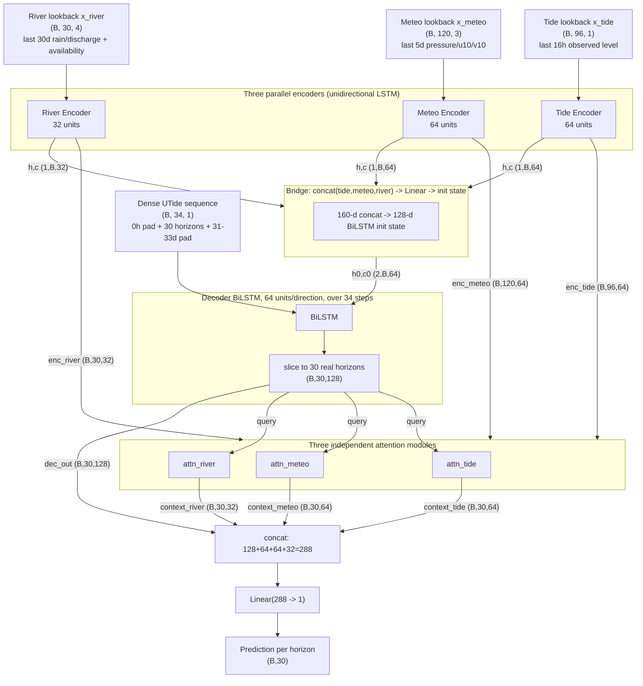

# Stage 3 Model Architecture — Multi-Resolution Meteorological Fusion

**Model:** `TidalSeq2SeqMulti` (three encoders — tide/meteo/river — + multi-branch attention + a densified, padded BiLSTM decoder), plus an ablation companion `TidalSeq2SeqTideOnly` (§5.5) that trains the identical decoder redesign without the meteo/river branches, to measure what they're actually worth rather than just predicting it from the EDA.
**Notebook:** [`stage3_meteo_fusion.ipynb`](stage3_meteo_fusion.ipynb)
**Builds on:** [`stage2_architecture.md`](stage2_architecture.md) — this note assumes you've read that one and doesn't re-derive what's unchanged (the LSTM cell itself, the shape-grammar convention, the general case for a non-autoregressive decoder). It focuses on what's new: fusing three different time resolutions into one model, a redesign of the decoder that fixes a real structural weak point *and* turns into the mechanism for extending the trained/evaluated horizon range from stage 2's 7 out to 30 days, a tide-only ablation to check the meteo/river data actually earns its keep, a training-data-volume ablation, and SHAP-based interpretability. This is a fixed multi-horizon predictor evaluated with tables and error-vs-horizon charts throughout, not a continuous forecaster — see §6.2 for why that's a deliberate choice, and §14 (of the notebook) for the research questions this whole stage is organized around.
**Task:** given the last 16h of observed Southend Pier water level, the last 5 days of pressure/wind, the last 30 days of rainfall/discharge, and the UTide astronomical tide prediction at every forecast point, forecast the water level at 30 horizons simultaneously — the same 7 as stage 2 (10min–168h), plus daily steps out to 30 days. Evaluated against **three** comparators throughout: UTide standalone, the full multi-branch model, and the tide-only ablation.

---

## 1. The one-paragraph version

Stage 2 was a single-resolution model: one encoder, reading one variable (observed water level) at one cadence (10 minutes), feeding one decoder. Stage 3 keeps that exact mechanism — LSTM encoder → attention → BiLSTM decoder fed a known-future covariate — but runs it **three times in parallel**, once per data source, each at its own native cadence: a 10-minute tide branch (unchanged from stage 2), an hourly meteorological branch (pressure, wind), and a daily river branch (rainfall, discharge). The three branches fuse at two points: their final hidden states seed the decoder's initial state (the "bridge"), and the decoder attends independently over each branch's full history when producing every horizon's prediction. On top of that fusion, the decoder itself changes shape: instead of stepping through 7 sparse horizon points, it steps through a **densified, padded sequence of 34 points**, of which 30 are real, trained, published forecast targets reaching out to 30 days — not just 7 reaching to a week. That single change does two jobs at once: it removes a genuine structural asymmetry in stage 2's decoder, and it extends the range over which Stage-3's accuracy can be directly, honestly compared against UTide (§5–6) — a wider evaluation range, not a forecast-visualization product (§6.2).

If you need to say it in one breath: *"three parallel encoders — tide, weather, river — each read their own variable at its own natural resolution, fuse into a shared decoder that steps through a dense, padded timeline of UTide values reaching a month out, and attention lets every one of those 30 forecasts pull in whichever branch and whichever moment of history is actually relevant to it."*

---

## 2. Inputs and outputs

| | shape | meaning |
|---|---|---|
| `x_tide` (tide encoder input) | `(B, 96)` | last 96 × 10-min observed water levels (16h), scaled — **unchanged from stage 2** |
| `x_meteo` (meteo encoder input) | `(B, 120, 3)` | last 120 hourly `[pressure_hpa, u10, v10]` (5 days), scaled |
| `x_river` (river encoder input) | `(B, 30, 4)` | last 30 daily `[rainfall, discharge, rainfall_available, discharge_available]`, scaled (availability channels unscaled 0/1) |
| `utide_dense` (decoder input) | `(B, 34)` | UTide reconstruction at 34 points: a leading "now" point, the 30 trained horizons, a trailing 3-day pad |
| `preds` (model output) | `(B, 30)` | predicted water level at each of the 30 horizons, scaled |
| `attn_weights` (side output) | 3× `(B, 30, T_branch)` | per-branch attention weights (tide: `T=96`, meteo: `T=120`, river: `T=30`) |

The 30 horizons, in order: `{10min, 1h, 6h, 24h, 48h, 72h, 168h}` (identical to stage 2 — the "headline" set, still what's reported against UTide) followed by `{8d, 9d, ..., 30d}` (new — see §5). `HEADLINE_HORIZONS` in the notebook is just the first 7 names of this same list, not a separate run.

Everything about stage2_architecture.md §2.1's shape grammar (`(B, T, F)`, what each slot means, how `.unsqueeze`/`nn.LSTM`/`torch.bmm`/`.softmax` move you between shapes) applies unchanged here — just read three times, once per branch, with different `T` and eventually-different `F`.

---

## 3. Overview diagram



---

## 4. The three encoder branches

**Code:** `Encoder` class — the exact same class as stage 2 §4, instantiated three times. Nothing about the class changed; only its arguments (`input_size`, `hidden_size`) differ per branch.

### 4.1 Why three separate encoders instead of one combined one

Pressure/wind arrive hourly, rainfall/discharge daily, the tide target every 10 minutes. Three ways to reconcile that were considered:

1. **Resample everything to 10 minutes.** Rejected: it would blow up the daily river series into ~144 duplicate rows for every real value it has, giving the model a mostly-fake sense of resolution it doesn't possess, and wastes compute (the river encoder would run 4,320 steps instead of 30 for no informational gain — a daily value doesn't become more informative by being copy-pasted 144 times).
2. **Downsample everything to daily.** Rejected outright: the entire tidal signal — the thing this whole project exists to predict — lives at a 10-minute cadence. Downsampling the tide target to daily throws away the actual task.
3. **One encoder per native resolution, fused after the fact.** What's implemented. Each branch reads its own variable at the cadence it's actually sampled at, and the model combines their *summaries*, not their raw values — the same principle as stage 2's attention already applies to *time* (different lookback positions get different weight per horizon), just extended to *source*.

### 4.2 Branch-by-branch, and why each lookback window is the length it is

- **Tide** (`hidden=64`, 96 steps, 10-min): unchanged from stage 2. See stage2_architecture.md §4 for the full M2-cycle reasoning (96 steps ≈ 1.3 semi-diurnal cycles — long enough to read phase/amplitude unambiguously, short enough that the surge signal it's meant to catch hasn't decorrelated).
- **Meteo** (`hidden=64`, 120 hours = 5 days, hourly `[pressure_hpa, u10, v10]`): the lookback isn't a guess — `EDA/meteo_eda.ipynb` §2.3 computed the pressure ACF directly and found it drops below 0.2 at 121 hours, calling out "a model lookback window of around 5 days (120h)" as the window that captures most of a synoptic system's informative history before it decorrelates. `u10`/`v10` are kept as native components rather than collapsed to speed, per the same EDA's finding (§3.1) that `v10` (north-south) is the single strongest covariate against the Southend residual (r≈-0.36 at ~3h lag) — stronger than speed or `u10` alone, and with a physically sensible sign (a northerly wind pushes water into the Thames Estuary funnel).
- **River** (`hidden=32`, 30 days, daily `[rainfall, discharge, rainfall_available, discharge_available]`): smaller hidden size, deliberately — the same EDA (§3.1) found **no meaningful correlation** between either rainfall or discharge and the Southend residual at any lag tested (0–14 days), which is physically expected: Kingston, where these are measured, sits at the tidal limit, far upstream of Southend near the estuary mouth. 30 days is a round window comfortably longer than the ~2-day rainfall→discharge catchment lag the EDA also found, long enough to reflect slower baseflow/antecedent-moisture state — but unlike the tide and pressure windows, it isn't derived from a residual-correlation peak, because the EDA didn't find one to derive it from. Included because the brief calls for "all these variables to work together," not because the EDA predicts it will carry much weight — the tide-only ablation (§5.5) and SHAP (§9) are where that expectation gets checked against what the trained model actually does, not just asserted.

### 4.3 What comes out of each branch

Same two things stage 2's single encoder produced, just three times: `enc_outputs` (the full per-timestep hidden-state sequence, what attention searches over) and `(h_n, c_n)` (the final hidden/cell state, what seeds the bridge).

---

## 5. The decoder — fusion, and a redesign that solves two problems with one change

**Code:** `MultiBranchTidalDecoder` class, generalizing stage 2's `TidalDecoder`.

### 5.1 The bridge, generalized

Stage 2's bridge (`init_h`/`init_c`) projected the tide encoder's single 64-d final state into the BiLSTM decoder's initial state. Here, the three branches' final hidden states are concatenated first (`64+64+32=160`-d) and *that* is what gets projected — same mechanism, wider input. Both halves of the projection (forward-direction init, backward-direction init) are still learned, still different projections of the same underlying summary, exactly as stage2_architecture.md §5 describes; the only change is that the summary now has three branches' worth of information baked into it instead of one.

### 5.2 The problem the user flagged: the BiLSTM's edges aren't symmetric

Stage 2 feeds exactly 7 points into a bidirectional LSTM. At decoder position $j$ (of 7): the forward hidden state $h^{fwd}_j$ only ever incorporates positions $1..j$; the backward hidden state $h^{bwd}_j$ only ever incorporates positions $7..j$. Every position gets *its own* horizon's UTide value fresh and undiluted — that part is symmetric, since it's the last input consumed in at least one direction, always. What's **not** symmetric is access to the other six horizons:

- **Position 1 (10min)**: the forward path contributes nothing beyond the shared initial state (no positions exist before it). Its only view of the other six horizons comes via the backward path — and even then, only after that signal has been recombined through up to 6 more LSTM cell updates (positions 7→6→...→2, before it reaches position 1).
- **Position 7 (168h)**: the mirror image. Nothing from the backward path beyond the shared initial state; its view of the other six comes only via the forward path, similarly diluted.
- **A middle position** (say 24h) gets a *moderately*-processed view from **both** directions (3 steps deep each way) — a more balanced blend than either edge gets.

This is a real, structural asymmetry, not just an intuition — though it's worth being precise about what it isn't: it doesn't mean the edges are blind to the other horizons (they aren't), and it isn't the *sole* explanation for why stage 2's skill-over-UTide shrinks with horizon (stage2_architecture.md §11's tide-ablation study shows RMSE degrading faster than UTide-alone as horizon grows for reasons that have nothing to do with sequence position — longer horizons are also just intrinsically harder). It is, however, a real, fixable contributor, and fixing it turned out to unlock something more useful than a patch.

### 5.3 The fix, and why it's one change, not two

The first version of this fix (considered, not shipped) kept the 7 published horizons exactly as in stage 2, and widened only the BiLSTM's *own* input sequence with extra hourly UTide context points before and after them — a purely structural patch, with those extra points never loss-supervised or read out as predictions.

But UTide can be computed exactly at *any* future timestamp, arbitrarily far out, with no degradation — unlike weather, which genuinely isn't knowable that far ahead by anyone. And the real Southend water level is just as available at t+30 days as it is at t+168h; it's the same continuous series, only a longer slice of it. So there's no reason those extra context points have to stay unsupervised. **The positional fix and a genuine 30-day forecast turn out to be the same underlying change**: instead of padding the decoder's sequence with throwaway context, extend the *trained, published* horizon set itself out to 30 days, and let the padding be only the small leftover margin beyond that.

**The sequence, concretely** (in the notebook, `DECODER_SEQ_STEPS`):

```
[0h (pad), 10min, 1h, 6h, 24h, 48h, 72h, 168h, 8d, 9d, ..., 30d, 31d (pad), 32d (pad), 33d (pad)]
```

34 points: 1 leading pad, the 30 real/trained/published horizons (the original 7 unchanged, plus daily steps from day 8 to day 30 — 23 more), 3 trailing pad points. All built from the *same already-computed* `utide_recon` array (just a wider slice of it — see §8 for why the reconstruction is extended 35 days past the last real gauge row specifically to make this safe). The BiLSTM runs over the full 34 steps; `dec_out` is then **sliced down to the 30 real-horizon positions** before anything downstream (attention, the output head) ever sees it — so everything after that slice is unchanged from a shape stage 2 would recognise, just wider (30 instead of 7).

What this buys, precisely:

- **No published horizon sits at the sequence's literal edge any more.** 0h and 33d absorb that role instead, and neither is ever read out as a prediction — so 10min's backward-direction context is now 33 real, ordered points instead of 6 sparse siblings, and 168h — which already had rich forward context — now *also* has real backward-direction neighbours (169h onward) instead of none.
- **A genuinely trained, loss-supervised comparison out to 30 days**, not an extrapolation grafted onto the end of a 7-horizon model. Every one of the 30 points in the notebook's evaluation table (its §10) is a real trained output, directly comparable to UTide at that same offset — see §6.2 for why this stays a table/chart comparison, not a forecast visualization.

**What the trailing pad (31d–33d) is *not*.** It's internal decoder context only — never loss-supervised, never read out as a prediction. It exists purely so the 30-day horizon isn't itself the sequence's literal terminus. Extending it further wouldn't extend what the model can honestly claim to forecast; only adding a genuinely new *trained* horizon (more entries in `HORIZONS`, retrained) would do that.

**A risk worth flagging, not hiding.** Pooling 10-minute-scale errors (~0.02m, per stage 2) and 30-day-scale errors (plausibly ~0.2–0.3m, UTide's own ballpark) into one unweighted mean-squared-error loss means the large-magnitude long-horizon errors dominate the gradient more than they did across stage 2's narrower range. Stage 2 already had a mild version of this (10min~0.017m vs 168h~0.235m, ~14×) and trained fine; widening to 30 days shifts the balance further. The notebook keeps **unweighted loss as the default** (matches "same training regime," and per-horizon validation RMSE is tracked separately so a short-horizon regression would show up), with an off-by-default `USE_HORIZON_LOSS_WEIGHTING` switch documented as the lever to reach for only if the headline 7 visibly regress against stage 2's own numbers.

### 5.4 Attention, generalized to three branches

Three independent `BatchedAttention` instances — the exact class from stage 2 §7, unmodified — one per branch, each attending only over its own branch's `enc_outputs`. `context_tide (B,30,64)`, `context_meteo (B,30,64)`, `context_river (B,30,32)`, each computed the identical Luong-style way: project query (the sliced `dec_out`) and keys (that branch's `enc_outputs`) into a shared space, score, softmax, and pull a weighted sum of the *raw* (unprojected) encoder outputs as context. `combined = cat([dec_out, context_tide, context_meteo, context_river])` → 288-d → `Linear(288, 1)` output head, the same "concatenate everything relevant, one linear readout" pattern as stage 2 §8, just with three context vectors feeding in instead of one.

### 5.5 The ablation companion: `TidalSeq2SeqTideOnly`

The EDA's own correlation analysis (§4.2) predicts the meteo/river branches won't move the needle much at this gauge — worth *checking* rather than just repeating as an assumption. `TideOnlyDecoder` is `MultiBranchTidalDecoder` with the meteo/river branches removed entirely: single-branch bridge (`init_h`/`init_c` project straight from the tide encoder's 64-d summary, no concatenation needed), single `attn_tide`, `out = Linear(2·dec_hidden + tide_hidden, 1)`. Everything that isn't about *which branches feed in* is identical — same 34-point densified/padded decoder sequence, same 30 trained horizons, same training regime, same seed. `TidalSeq2SeqTideOnly` wraps just the tide `Encoder` and this decoder.

Holding the decoder redesign and horizon set fixed and only removing the meteo/river branches is what makes the RMSE comparison in the notebook's evaluation section (its §10) a genuine, controlled ablation rather than a confound — the same discipline stage 2 §14.1 used to isolate UTide's own contribution from the architecture change around it. **One deliberate exception**: the two models do *not* train with identical hyperparameters. Each runs its own random hyperparameter search (§11.2) and is retrained at its own winning learning rate/weight decay/batch size — forcing one shared config onto two architecturally different models (a 160-d three-branch bridge vs. a 64-d single-branch one) risks quietly handicapping whichever one prefers different settings, which would bias this comparison in an uncontrolled direction. What *is* still held identical: architecture family, data splits, seed, and the final run's epoch budget/patience — so the gap that remains is attributable to the meteo/river data, each model given its own fair shot at the best settings for its own architecture.

---

## 6. How this model actually forecasts — and how it's different from autoregression

This is the question worth being precise about, because "the model forecasts 30 days" can mean two different things, and only one of them is what's actually built.

### 6.1 What a single forward pass actually is

One forward pass takes **one anchor** ("now" — the last tide-encoder timestep) and produces **30 simultaneous, independent, non-autoregressive point predictions** — 10 minutes to 30 days ahead — in one shot. None of the 30 feed into each other. None of them feed into a later re-run of the model. This was already true of stage 2's 7 horizons (stage2_architecture.md §6 is the full case for why: UTide is known in advance at every horizon, so there's no need to generate horizon $k{+}1$ from a guess at horizon $k$ the way a translation decoder would) — stage 3 doesn't change that principle, it just asks more of it.

### 6.2 This is a fixed multi-horizon predictor, not a continuous forecaster — and that's deliberate

Worth being explicit about, since it's easy to expect otherwise: the model's output is 30 specific numbers, corresponding to 30 specific, hand-chosen offsets from the anchor (10min, 1h, 6h, 24h, 48h, 72h, 168h, then one point per day out to day 30). It has no opinion about any offset that isn't one of those 30 — there's no way to ask it "what about 35 minutes from now" or "9 days and 6 hours," because no such target was ever in its output layer or its training data. Densifying that grid (e.g. asking for a value at every native 10-minute step out to a month) was considered and deliberately not built: the recurrent decoder's cost scales with how many points it steps through, and a genuinely dense grid to 30 days (~4,000+ points) would very likely make training impractically slow for what this project actually needs — a set of directly comparable accuracy numbers at meaningful checkpoints, not a forecast-shaped visualization product. See §14 for what this stage is actually organized around instead.

Because of that, every result in this notebook is a **table or an error-vs-forecast-distance chart, never a plot against calendar time**. A chart with forecast horizon on the x-axis (§10, §12) is a performance metric — each point is an average over the *entire* test set at that one fixed offset — not a walk through a timeline. Nothing in this notebook shows "the model's forecast for next month" as a single continuous line, because that's not what a 30-point discrete predictor honestly produces.

### 6.3 Why this can reach 30 days when a weather-driven forecast couldn't

The entire reason a 30-day *trained* horizon is legitimate here — and wouldn't be if the decoder's known-future input were, say, a weather forecast instead of UTide — is that **UTide is deterministic**. It's a sum of a few dozen fixed-frequency sinusoids fit once to historical data; it can be evaluated at any timestamp, past or future, with the same exactness a week out or a year out, because nothing about it depends on *observing* anything between now and then. Weather can't do that: even the best numerical weather prediction loses meaningful skill past roughly a week to two, because the atmosphere is chaotic and genuinely isn't determined by its current state at 30-day range. That's precisely why §4.2 kept pressure/wind/rainfall/discharge as *historical, encoder-side* inputs only, never decoder-side (stage2_architecture.md §6's "known-future covariate" principle, restated) — there's no real 30-day-ahead weather to hand the decoder even if the architecture wanted to.

### 6.4 The one honest caveat — read directly off the RMSE-vs-horizon chart, not asserted here

Extending the trained horizon set to 30 days does **not** imply the model's *skill over UTide-alone* holds all the way out. Stage2_architecture.md §6.1 already measured, on this exact dataset, that a model correcting UTide runs into an information ceiling once the surge/weather signal it's correcting for has decorrelated from anything knowable at forecast time — that's a property of the physical surge process, not of this architecture, and it doesn't go away by asking the model to output further horizons. What's genuinely new in stage 3 is that this question is now answerable directly, at every one of 30 points, rather than being dodged: the notebook's evaluation section (its §10) and research-questions summary (its §14) show exactly where — if anywhere — Stage-3's advantage over UTide narrows toward zero. Whatever that turns out to be (continued if-shrinking benefit, or convergence to ≈UTide by some point) is a legitimate, reportable empirical result either way, not a flaw in the design.

### 6.5 What it would take to go further, and why it probably wouldn't help much

Nothing architectural stops `HORIZONS` from being extended past 30 days — add e.g. `60d`/`90d` entries and a wider pad, retrain. The reason that's not done here isn't difficulty, it's expectation: §6.4's information-ceiling logic suggests the learnable correction on top of UTide has *already* mostly vanished well before 30 days for a surge signal that decorrelates over hours-to-days, so a longer horizon would very likely just converge to ≈UTide sooner rather than later — worth confirming empirically (the RMSE chart already shows the trend), not worth assuming needs building further to find out.

---

## 7. Handling the rainfall/discharge gap

`EDA/meteo_eda.ipynb` §1.1/§4 established that rainfall stops **2023-12-31** and discharge stops **2024-09-30** — both inside the 2021–2024 test split, and both files are complete across the entire train (2004–2017) and validation (2018–2020) splits, so nothing about how scalers or climatology are fit is ambiguous or leaky.

Each series is built into a **complete, regular daily grid over 2004–2024** (extended a little further, to give the decoder's own trailing pad — §5.3 — room, and independently to give UTide's reconstruction room, §8): real values where present; where missing, filled with that variable's **train-split month-of-year climatology** — discharge is strongly seasonal (the EDA found ~4–7× higher winter than late-summer flow), so a flat fill would misrepresent it; rainfall is close to flat seasonally, so the climatology fill is nearly a constant one for it regardless. A parallel **binary availability channel** (1 = real, 0 = filled) rides into the river branch as its own input feature, mirroring the project's existing `is_imputed`/`is_chatter_flagged` convention on the tide gauge itself — flag synthetic values and let the model learn to discount them, rather than silently feed it a plausible-looking but fabricated number.

The daily→10-minute lookup uses "most recent day at or before the anchor" (same-day allowed) — a small, deliberate simplification matching the join approach the download notebook (`src/meteo_data_download_colab.ipynb`) itself names as intended ("forward-fill for the daily discharge and rainfall"), rather than a stricter same-day-excluded rule invented for this stage. Worth naming plainly: this is a minor same-day-aggregate look-ahead on a slow-moving daily covariate, and it's immaterial in practice given §4.2's finding that neither variable correlates meaningfully with the Southend residual at any lag.

Given the EDA's own finding, the expectation going in is that this branch contributes little regardless of how the gap is handled — SHAP (§9) is where that expectation gets checked, not just assumed.

---

## 8. UTide reconstruction — reused, extended

Same fit as stage 2 (`lat=51.5145`, `method='ols'`, fit on the training split only, flagged points excluded), but reconstructed over a window extended **35 days past the last real gauge row** rather than stopping there. This is safe specifically because UTide is a deterministic function of clock time, entirely determined by coefficients fit only on training data — extending the window it's *evaluated* over doesn't touch, and can't leak, any real observation; it just computes the same fixed function a little further along. That extension is what makes the decoder's 33-day trailing pad (§5.3) — and, near the very end of the dataset, the tail of the 30-day-ahead targets themselves — always computable.

---

## 9. Interpretability: SHAP

**Why**: attention weights (returned alongside every prediction, one set per branch) already show *where* in each branch's history a prediction is looking, but they're not a rigorous measure of how much each input actually moved the output — SHAP is the complementary piece, and doubles as a direct check on the EDA's own correlation findings (does the trained model actually lean on `v10` more than rainfall, the way §4.2's correlation analysis predicted it should?).

**Method**: `shap.GradientExplainer`, not `KernelExplainer`. With four branches' worth of raw scalar inputs (96 tide + 360 meteo + 120 river + 34 decoder-sequence values, per explained prediction), kernel SHAP would need far more model evaluations than is practical; `GradientExplainer` uses backprop directly and natively supports a model with multiple input tensors (a list in, a list of per-input attribution arrays out). A background sample of real training windows anchors the explanation; a separate sample of test windows is what's explained, for a representative subset of horizons (10min, 6h, 24h, 168h, 14d, 30d by default) rather than all 30, purely to keep runtime reasonable.

**Aggregation**: raw per-scalar attributions are too granular to read directly, so they're summed into **branch/variable-level contributions** (tide history, pressure, `u10`, `v10`, rainfall, discharge, river-availability flags, UTide) per horizon — a grouped bar chart across the chosen horizons. A second plot breaks the tide branch down further, by lookback position, showing which of the 96 recent readings matter most per horizon — the direct SHAP counterpart to inspecting the model's own attention weights.

**Caveat, stated plainly**: SHAP on correlated, autocorrelated time-series inputs (adjacent tide or pressure readings move together) can split or share credit between them in ways that don't map cleanly onto physical intuition. Read the output as *relative importance under this specific attribution scheme*, not literal causal ground truth — useful for "which branch does the model lean on, and does that match the EDA," not for a stronger claim than that.

**A GPU-specific wrinkle, worth knowing if this cell errors.** `GradientExplainer` needs a backward pass through the model's LSTMs, and cuDNN's fused RNN kernel only keeps the state its backward pass needs when the forward call ran in `.train()` mode — an `.eval()`-mode cuDNN RNN raises `RuntimeError: cudnn RNN backward can only be called in training mode` if `.backward()` is attempted anyway. This is a known, documented cuDNN limitation, not a bug in SHAP or in this notebook.

The fix used here keeps the model in genuine `.eval()` mode throughout (correct, since SHAP is explaining a trained model, not training one) and instead wraps the whole SHAP loop in `torch.backends.cudnn.flags(enabled=False)`, which disables cuDNN's fused RNN kernel for that block only and routes PyTorch to its generic (non-cuDNN) RNN implementation — one that was never subject to the training-mode restriction in the first place. This is more surgical than the alternative fix (flipping the model into `.train()` mode for the SHAP loop and relying on the architecture having no `Dropout`/`BatchNorm` to make that safe): the `cudnn.flags` approach doesn't depend on that invariant staying true, so it won't silently break if a regularization layer is added later. The only cost is a slower, non-fused RNN kernel for this section alone — acceptable here since it's already scoped to a subset of horizons/samples to keep runtime reasonable. Not verified against a real GPU locally (no CUDA available in this environment) — it's the standard documented fix for this exact restriction, but worth confirming it clears cleanly on the actual Colab run.

This is also why SHAP is placed *last* in the notebook (its §13): it's a gradient-based analysis layered on top of an already-fully-trained, already-saved model, not a dependency of anything else, so if it hits an environment-specific issue that doesn't reproduce on CPU, both main models, their evaluation, both checkpoints, and the training-data ablation have already run and saved.

---

## 10. Training-data-volume ablation

Answers "how does the amount of training data affect accuracy" directly — mirrors stage2_architecture.md's own reduced-training-window study (its §14.3) exactly, extended to the multi-branch model. Train end fixed at 2018-01-01, validation/test unchanged (2018–2020 / 2021–2024); only the training window's *start* moves: 2015 (3yr), 2011 (7yr), 2008 (10yr), against the full 2004–2018 (14yr) used everywhere else. **UTide is refit separately for each window** — with less history its own constituent estimates degrade too, so a UTide-only comparator is tracked alongside the retrained model, separating "the network has less to learn from" from "the tidal input it's given is itself worse," the same distinction stage 2 drew.

Every train-derived statistic is refit per scenario — UTide, the tide/meteo scalers, exactly as the network itself is retrained. `build_windows_stage3` (§6) takes an optional `utide_full`/`utide_start` override for exactly this purpose — defaulting to the main run's globals when omitted, so the existing call sites (§6) are untouched, and the ablation passes its own re-fit reconstruction explicitly instead. Validation and test windows are *rebuilt*, not reused, for each scenario: the decoder's UTide input (and the UTide-standalone comparator) must reflect what a model trained only on that window would actually have seen, even though the real observed targets don't change.

**Hyperparameters go the other way: held fixed, deliberately**, at whatever §11.2's random search found best for the full 14-year model, across every reduced-training scenario here. That's the mirror image of §5.5's choice to tune the tide-only ablation independently — there, architecture was the one variable allowed to move, so hyperparameters had to be free to adapt; here, training-data volume is the one variable meant to move, so re-searching hyperparameters per scenario would confound "less data" with "different optimization," exactly the ambiguity this ablation exists to rule out.

**A second, unrelated simplification, stated rather than hidden**: the rainfall/discharge climatology fill (§7) stays fixed to the full-history version across all scenarios, rather than being re-derived per window. The river branch already shows the weakest signal of anything in this model (per the tide-only ablation and SHAP results in the notebook's §10/§13), so re-deriving a monthly climatology three more times was judged not worth the added complexity for an expected negligible effect.

Only the full (meteo-fusion) model is retrained here — matches stage 2's own scope, which tested reduced data on its one main model, not every baseline. This is the most expensive section in the notebook (3 more full training runs on top of the 2 already there).

---

## 11. Training regime

### 11.1 What's reused verbatim from stage 2

`train_model`, `masked_mse`, `batch_iter`, `compute_metrics`, `masked_rmse_mae` are stage 2's own functions, essentially **unchanged** (`train_model` gained one new optional `weight_decay=0.0` parameter, passed straight through to Adam — see §11.2 — everything else about it is untouched) — they only ever reference `batch['Y']`/`batch['Flag']` and call `predict_fn(model, batch)` generically, so the wider batch dict here (`X`, `Xm`, `Xr`, `Ydec`, `Y`, `Flag`) needed no other edits at all. Same discipline throughout: masked MSE in scaled units, `ReduceLROnPlateau` (patience 3, factor 0.5), early stopping (patience 10 for the final run, best-validation weights restored, not last-epoch), full seeding (`SEED=42`). Every new variable gets its own **train-split-only** z-score scaler, the same discipline stage 2 used for `Observed_ODN`/`utide_recon`.

Only this stage's architecture is trained — no stage-1/stage-2 baselines are re-trained here; **UTide standalone** is the comparator throughout, evaluated on the exact same windowed targets.

### 11.2 Random hyperparameter search — learning rate, weight decay, batch size

Stage 2 trained at one fixed, hand-picked learning rate (`1e-3`) and never searched around it. Stage 3 keeps `1e-3` as the *centre* of a search range rather than the value either model actually trains at: `sample_hparams` draws a candidate config (learning rate log-uniform over `[3e-4, 3e-3]`, weight decay from `{0, 1e-5, 1e-4}`, batch size from `{256, 512, 1024}`), and `random_search` runs `N_SEARCH_TRIALS=6` of them per model at a **reduced** budget (`SEARCH_EPOCHS=12`, `SEARCH_PATIENCE=4`) — cheap enough to be a proxy for the full 60-epoch run without paying its full cost six times over. Each trial re-instantiates its model from the **same seed**, so weight initialization and batch order are identical trial to trial; only the sampled hyperparameters vary, which is what makes comparing trials by validation loss meaningful rather than noise. The trial with the lowest best-epoch validation loss wins; every trial (not just the winner) is logged to `stage3_lr_search_multi.csv` / `stage3_lr_search_tideonly.csv`, so the search itself is auditable.

The winning config is then what actually gets trained at full budget (`EPOCHS=60`, `PATIENCE=10`) — that retrain, not the (short, throwaway) search trial, is the model evaluated in the notebook's §10 and saved in its §11. Both main models run this search **independently** — see §5.5 above for why forcing one shared config onto both would be the wrong call, and §10 of this doc for the opposite choice made in the training-data-volume ablation (hyperparameters held fixed there, deliberately, because a different variable is the one meant to move).

**Not searched**: architecture-level knobs (hidden sizes, number of attention heads, lookback lengths) stay at the fixed values in §4.2/§5 — those are coupled tightly enough across the three branches and the bridge that searching them would mean re-deriving the whole model's shape per trial, a materially larger undertaking than tuning the optimizer. The brief was "especially learning rate," and the search space here reflects that: the lever most directly responsible for whether training converges well at all, plus its two closest optimizer-level neighbours (weight decay, batch size), not a full architecture search.

---

## 12. Design rationale — the decisions that matter most

1. **Three encoders, one per native resolution, rather than one resampled-to-a-common-grid encoder.** Keeps every source's actual sampling density honest instead of manufacturing false precision (daily→10-min) or destroying the target signal (10-min→daily). §4.1.
2. **UTide stays the only decoder-side (known-future) input.** The one thing that's genuinely knowable in advance at arbitrary range; nothing else in this repo is. §6.3.
3. **The decoder's own sequence is densified and padded, extending the trained/evaluated horizon range to 30 days as the same change that fixes the positional-edge asymmetry.** Not two separate features bolted together — the second only exists because fixing the first honestly required real targets, not throwaway padding, once it was clear UTide could supply them. §5.2–5.3.
4. **A fixed multi-horizon predictor, evaluated with tables and error-vs-horizon charts, not a continuous forecaster.** The output is 30 specific numbers, never a curve — every chart in the notebook keeps calendar time off every axis, deliberately, so nothing reads as a forecast the model doesn't actually produce. §6.2.
5. **Climatology fill + an explicit availability flag for the two gapped river variables, rather than dropping them or silently forward-filling without a signal.** Mirrors the project's own `is_imputed` convention; low-risk given the EDA's own finding that these variables carry little signal at this gauge regardless. §7.
6. **A tide-only ablation and a training-data-volume ablation, each holding a *different* thing fixed on purpose.** The tide-only ablation holds architecture family/data/seed fixed but tunes hyperparameters independently per model, since architecture is the variable meant to move; the training-data ablation holds hyperparameters fixed (at the full model's search winner) but moves the training window, since data volume is the variable meant to move there. Same underlying discipline — hold everything fixed except the one thing being tested — applied to two different "one things." §5.5, §10, §11.2.
7. **SHAP alongside attention, not instead of it.** Attention shows where a prediction looks; SHAP is a check on how much moving each input actually matters — genuinely complementary questions. §9.
8. **Random hyperparameter search (learning rate, weight decay, batch size), not a single value copied from stage 2.** Stage 2's `lr=1e-3` becomes the centre of a search range rather than a value either model trains at directly; each model searches and is retrained independently. §11.2.

---

## 13. Glossary (additions beyond stage2_architecture.md §12)

| Term | Meaning here |
|---|---|
| Branch | One of the three parallel encoder pipelines (tide / meteo / river), each with its own `Encoder` and its own `BatchedAttention` instance |
| Bridge | The `init_h`/`init_c` projection from the concatenated multi-branch summary into the decoder's initial state — same role as stage 2's, wider input |
| Dense/padded decoder sequence | The 34-point UTide sequence the BiLSTM decoder actually steps through: 1 leading pad + 30 real horizons + 3 trailing pad |
| Headline horizons | The 7 horizons unchanged from stage 2 (10min–168h) — a named subset of the 30, not a separate model or run |
| Availability channel | A 0/1 input feature marking whether a river-branch value is a real observation or a climatology fill |
| Tide-only ablation | `TidalSeq2SeqTideOnly` — the identical decoder redesign with the meteo/river branches removed, to isolate what they're worth |
| Reduced-training scenario | One of the 3yr/7yr/10yr training-window variants in §10, with its own refit UTide and scalers |
| Search trial | One short-budget (`SEARCH_EPOCHS`/`SEARCH_PATIENCE`) training run at one sampled hyperparameter combo, in §11.2's random search — a proxy result, not the reported model |
| Winning config | The search trial with the lowest best-epoch validation loss; what the model is actually retrained at, at full budget, in the notebook's §9b |

---

## 14. Quick cross-reference to the notebook

| Concept | Notebook section | Key names |
|---|---|---|
| Hyperparameters, horizon/decoder-sequence construction | 1. Setup | `HORIZONS`, `HEADLINE_NAMES`, `DECODER_SEQ_STEPS`, `TARGET_SLICE_IN_DECODER` |
| Meteo preprocessing, climatology fill, availability masks | 3 | `rain_filled_s`, `daily_rain_avail_arr`, etc. |
| UTide reconstruction (extended range) | 4 | `utide_recon_full`, `UTIDE_EXT_DAYS` |
| Multi-resolution windowing | 6 | `build_windows_stage3`, `gather_window` |
| Encoder / Attention (reused from stage 2) | 8a/8b | `Encoder`, `BatchedAttention` |
| Decoder + bridge (new) | 8c | `MultiBranchTidalDecoder` |
| Full model | 8d | `TidalSeq2SeqMulti` |
| Tide-only ablation (new) | 8e | `TideOnlyDecoder`, `TidalSeq2SeqTideOnly` |
| Training loop internals (reused from stage 2) | 9 | `train_model`, `masked_mse`, `batch_iter` |
| Random hyperparameter search, independent per model (new) | 9a | `sample_hparams`, `random_search`, `search_trials_multi`, `search_trials_tideonly` |
| Final training at winning hyperparameters, both main models | 9b | `stage3_model`, `stage3_tideonly_model`, `LR_MULTI`, `LR_TIDEONLY` |
| Evaluation vs. UTide (headline-7 and full-30, 3-way, observed-level context) | 10 | `compute_metrics`, `metrics_df`, `with_observed_row` |
| Save both checkpoints | 11 | `checkpoint_path`, `tideonly_checkpoint_path` |
| Training-data-volume ablation (new) | 12 | `prepare_reduced_scenario`, `REDUCED_TRAIN_STARTS` |
| SHAP | 13 | `HorizonWrapper`, `shap_df` |
| Research questions — summary of findings | 14 | (prints a compact answer to each of the five questions below) |

---

## 15. The five research questions this stage was built to answer

(Notebook section numbers below — see §14's table for this doc's own numbering, which differs.)

1. **How can ML improve traditional water level forecasting methods?** The headline comparison in the notebook's evaluation section (its §10): UTide standalone vs. Stage-3 (meteo fusion) vs. Stage-3 (tide-only), across all 30 trained horizons.
2. **How accurately do these models predict total water level relative to UTide harmonic reconstruction?** The same section's headline-7 and full-30 RMSE/MAE tables, each with an observed-water-level reference row for scale.
3. **How does relative performance vs. harmonic prediction change across forecast horizons (days, months, years)?** The full RMSE-vs-horizon curve in that same section covers days through ~1 month. Years are deliberately not attempted — §6.4–6.5 of this doc explain why (data-availability cost for a result the 30-day trend already predicts).
4. **Does adding meteorological covariates improve accuracy?** §5.5's tide-only ablation (a controlled RMSE comparison, each model independently hyperparameter-tuned per §11.2 so neither is handicapped by the other's optimal settings, reported alongside the main evaluation), cross-checked against §9's SHAP attribution (notebook §13).
5. **How does available training data affect accuracy?** The reduced-training-window ablation — §10 of this doc, §12 in the notebook.
